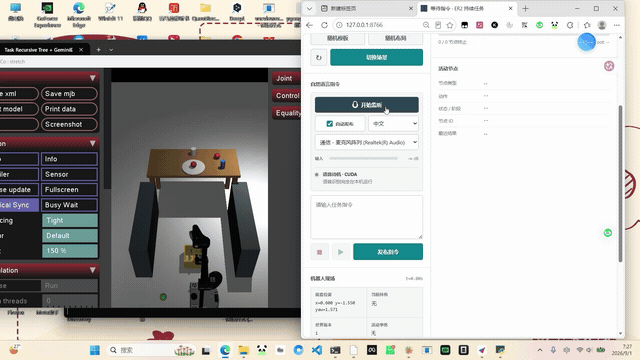
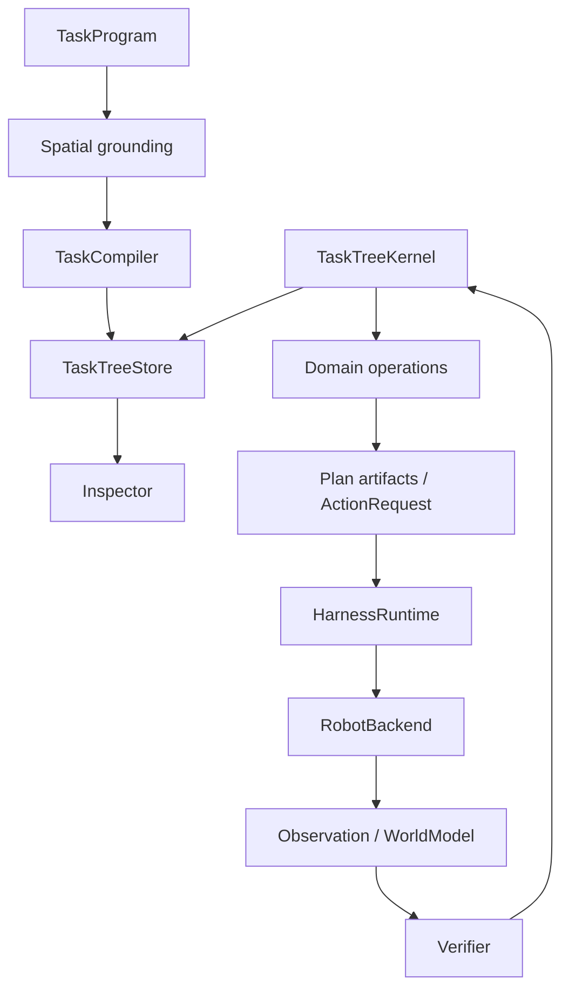

# Task Recursive Tree

[中文](README.md) · [Watch the demo](https://zwdmw.github.io/task-recursive-tree-core/) · [Architecture](ARCHITECTURE.md) · [Contributing](CONTRIBUTING.md)

A recursive task-tree runtime for mobile manipulation. It connects task intent, spatial grounding, planning, physical execution, observation and verification, with explicit recovery steps in an inspectable tree.

## Demo video

[](https://zwdmw.github.io/task-recursive-tree-core/)

**[Play the full video](https://zwdmw.github.io/task-recursive-tree-core/)** · [Download MP4](https://github.com/zwdmw/task-recursive-tree-core/releases/download/v0.1.0/harness-workflow.mp4) · [Video in this repository](docs/media/harness-workflow.mp4)

26 seconds · 1920 × 1080 · H.264 / AAC. The recording shows task submission and robot execution in the GeminiER2Harness + MuJoCo integration. The original MP4 is included in the repository.

## Quick start

Python 3.11+ runs the core demos with the included deterministic planar robot backend.

```bash
git clone https://github.com/zwdmw/task-recursive-tree-core.git
cd task-recursive-tree-core
python -m venv .venv
source .venv/bin/activate  # Windows PowerShell: .\.venv\Scripts\Activate.ps1
python -m pip install -e .
trt-demo --tree-output .artifacts/demo.json
trt-demo --blocked --tree-output .artifacts/blocked.json
```

The first command executes a placement task. The second adds a movable blocker and exercises recursive recovery. Each prints the task tree and status; JSON exports retain nodes, events and the execution stack.

Start the core browser console:

```bash
trt-server --no-browser
```

Open the address printed by the server, normally `http://127.0.0.1:8770/`.

## Architecture



The store holds authoritative tree state. The kernel schedules nodes and explicit recovery steps. Physical requests pass through a serialized runner and SQLite WAL journal, followed by observation and independent verification. Continuous sessions retain their world and physical backend while creating a fresh tree for each task.

See [ARCHITECTURE](ARCHITECTURE.md), [the full runtime reference](docs/runtime-reference.md), and [GeminiER2 integration setup](docs/INTEGRATION.md) for contracts and external environment requirements.

## Development

```bash
python -m pip install -e '.[dev]'
python scripts/check_core.py
```

This executes both demos and the core tests. Integration tests use the separate Harness environment described in the [integration guide](docs/INTEGRATION.md).

## License

[MIT](LICENSE) · Copyright © 2026 zwdmw. External components retain their respective licenses; see [NOTICE](NOTICE.md).
