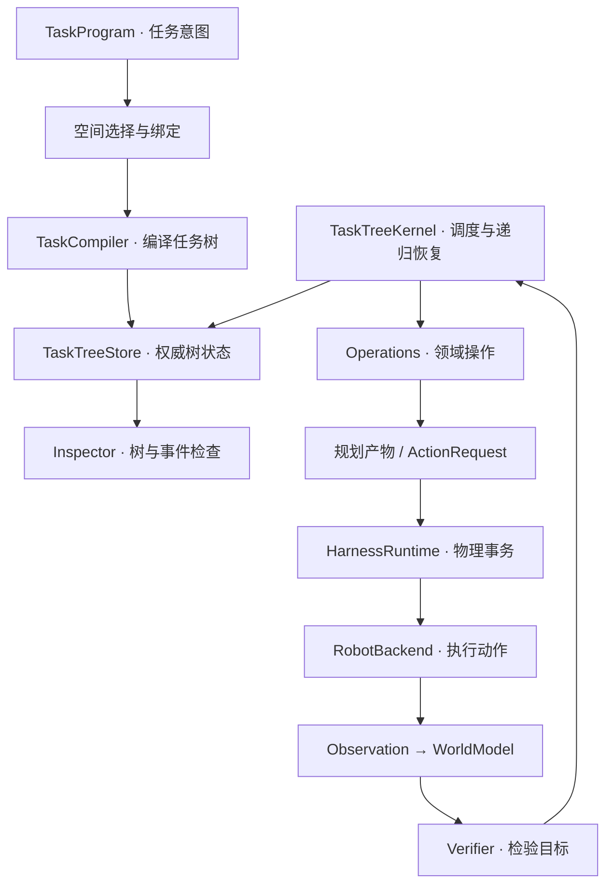

# Task Recursive Tree · 任务递归树

[English](README.en.md) · [观看演示](https://zwdmw.github.io/task-recursive-tree-core/) · [架构详解](ARCHITECTURE.md) · [参与贡献](CONTRIBUTING.md)

面向移动操作任务的递归任务树运行时。它把任务意图、空间定位、规划、物理执行、观察与验证连接起来，并将失败后的恢复过程展开为可检查的任务树。

## 效果视频

[](https://zwdmw.github.io/task-recursive-tree-core/)

**[在线播放完整视频](https://zwdmw.github.io/task-recursive-tree-core/)** · [下载 MP4](https://github.com/zwdmw/task-recursive-tree-core/releases/download/v0.1.0/harness-workflow.mp4) · [仓库中的视频文件](docs/media/harness-workflow.mp4)

26 秒 · 1920 × 1080 · H.264 / AAC。视频展示 GeminiER2Harness + MuJoCo 集成环境中的任务提交、任务树执行和机器人操作，原始 MP4 随仓库保存。

## 从这里开始

| 想做什么 | 入口 |
| --- | --- |
| 先看运行效果 | [视频播放页](https://zwdmw.github.io/task-recursive-tree-core/) |
| 运行核心任务树与递归恢复演示 | 下方快速开始；Python 3.11+ |
| 查看任务树、事件和物理事务记录 | CLI JSON 输出与 `trt-server` 浏览器控制台 |
| 了解 GeminiER2 / MuJoCo 接入 | [集成运行说明](docs/INTEGRATION.md) |
| 了解设计和完整契约 | [ARCHITECTURE](ARCHITECTURE.md)、[原始运行参考](docs/runtime-reference.md) |

## 快速开始

核心演示使用仓库内的确定性平面机器人后端，安装后即可执行。

```bash
git clone https://github.com/zwdmw/task-recursive-tree-core.git
cd task-recursive-tree-core
python -m venv .venv
```

激活虚拟环境：

```bash
# Linux / macOS
source .venv/bin/activate
```

```powershell
# Windows PowerShell
.\.venv\Scripts\Activate.ps1
```

安装并运行：

```bash
python -m pip install -e .
trt-demo --tree-output .artifacts/demo.json
trt-demo --blocked --tree-output .artifacts/blocked.json
```

两次演示分别展示正常任务执行和加入可移动障碍后的递归恢复，终端会打印任务树和执行状态。JSON 包含树节点、事件及执行栈，方便检查每一步的决策。

打开核心运行时的浏览器控制台：

```bash
trt-server --no-browser
```

在浏览器访问终端打印的地址，默认是 `http://127.0.0.1:8770/`。`Ctrl+C` 关闭服务。

## 架构总览



`TaskTreeStore` 保存权威任务树状态，`TaskTreeKernel` 调度节点与恢复逻辑。规划输出不可变产物，物理请求进入带有 SQLite WAL 记录的串行执行器；执行后重新观察世界，再由验证器检查目标是否达成。持续会话为每个新任务创建树，并保留当前世界、后端和事务记录。

## 测试与开发

```bash
python -m pip install -e '.[dev]'
python scripts/check_core.py
```

检查运行正常 / 障碍演示，并执行核心测试集。GeminiER2 适配器测试使用另一组命令，所需 Harness 环境与说明见[集成运行说明](docs/INTEGRATION.md)。

## 项目结构

```text
src/task_recursive_tree/
  core/          通用类型与共享模型
  task/          任务意图、节点、编译与调度
  selection/     空间选择与绑定
  capabilities/  A* / IK / RRT 规划
  robot/         参考机器人后端与控制器
  world/         观测、空间关系和世界状态
  runtime/       物理执行、事务与恢复
  web/           核心浏览器控制台
  integrations/  GeminiER2Harness 适配器
scripts/         检查与文档工具
tests/           核心与集成测试
docs/media/      原始效果视频、GIF 与预览图
```

实际模块目录和职责见[架构文档](ARCHITECTURE.md)。

## 许可

本项目采用 [MIT License](LICENSE)，版权所有 © 2026 zwdmw。集成环境中的 GeminiER2Harness、MuJoCo、语音模型及其他外部组件按各自许可使用；外部依赖与项目关系见 [NOTICE](NOTICE.md)。
