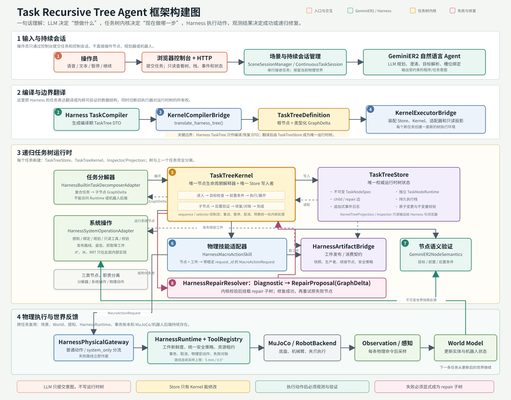

# Task Recursive Tree Agent 框架构建图



## 一句话理解

LLM 负责把人的自然语言转成受约束的任务意图；`TaskTreeKernel`
负责解释任务树并决定下一步；GeminiER2 Harness 负责世界、感知、
规划工具和物理执行；动作后的新观测决定节点成功、失败、对账或递归修复。

## 主流程

1. 操作员从浏览器用语音或文本提交任务。
2. GeminiER2 持续会话调用 LLM 完成规划、澄清和实体绑定。
3. Harness `TaskCompiler` 生成编译期 TaskTree DTO。
4. `KernelCompilerBridge` 将 DTO 翻译成 `TaskTreeDefinition`。
5. `KernelExecutorBridge` 为本任务创建新的 `TaskTreeStore` 和
   `TaskTreeKernel`，并装配各类 GeminiER2 适配器。
6. 内核按“目标检查、前置条件、展开/执行、子节点、后置验证”的生命周期
   推进任务树。
7. 物理节点先由 `HarnessMacroActionSkill` 生成 `MacroActionRequest`，
   再通过 `HarnessPhysicalGateway` 进入 Harness 和 MuJoCo/机器人。
8. 每条物理命令后重新观测世界；失败转换成 `Diagnostic`，修复器返回
   `RepairProposal(GraphDelta)`，内核校验并挂载 repair 子树后重试。

## 最重要的所有权边界

| 边界 | 规则 |
| --- | --- |
| LLM | 可以输出任务程序，不能输出或修改运行时树状态 |
| Harness TaskTree | 只作编译或恢复 DTO，不能成为第二份运行时树 |
| `TaskTreeStore` | 唯一权威树状态 |
| `TaskTreeKernel` | 唯一节点生命周期解释器，也是 Store 的唯一写入者 |
| 分解器 | 只能返回类型化 `GraphDelta` |
| 系统操作 | 可读世界、做规划、发布工件，但不能调用机器人 |
| 物理技能 | 只能把工件翻译成请求，不能直接访问 Runtime/Backend |
| HarnessRuntime | 唯一物理执行入口 |
| Verifier / Semantics | 只根据观测后的世界状态判断结果 |
| RepairResolver | 只能提出修复子树，不能直接改树 |

## 每个任务新建与跨任务复用

**每个任务新建：**

- `TaskTreeStore`
- `TaskTreeKernel`
- `KernelTreeProjection` / Inspector
- 当前任务的执行栈、节点运行态和事件

**跨任务复用：**

- 场景和 World Model
- 感知与谓词
- HarnessRuntime 和工具注册表
- 事务记录
- MuJoCo / 机器人后端

因此，一条新指令会得到一棵干净的新任务树，但会从上一条指令执行后的真实
世界状态继续。

## 放置任务的典型展开

```text
放置 Place
├─ 解析并检查对象与目标区域
├─ 规划抓取
├─ 提前规划持物运输
├─ 抓取 Pick
│  ├─ 移动到抓取位
│  ├─ 执行抓取
│  └─ 确认已经持有
├─ 持物移动 TransferHeld
│  ├─ 切换运输姿态
│  ├─ 按安全路线移动
│  └─ 确认可以放置
├─ 释放 Release
│  ├─ 执行释放
│  └─ 确认已经松开
└─ 确认物体到达目标区域
```

路线失败时，不会由 A* 或控制器偷偷搬动物体。失败节点会通过 `repair`
边挂载一棵显式子树，例如先递归执行 `Place(阻挡物, 停放区)`，重新规划
受影响的工件，再回到原节点重试。

## 源码索引

| 图中模块 | 源码 |
| --- | --- |
| 服务入口 | `src/task_recursive_tree/integrations/gemini_er2/server.py` |
| 编译桥 | `src/task_recursive_tree/integrations/gemini_er2/compiler.py` |
| 执行装配桥 | `src/task_recursive_tree/integrations/gemini_er2/executor.py` |
| 树内核 | `src/task_recursive_tree/task/kernel.py` |
| 权威 Store | `src/task_recursive_tree/task/store.py` |
| 节点、边、GraphDelta | `src/task_recursive_tree/task/model.py` |
| 分解器适配 | `src/task_recursive_tree/integrations/gemini_er2/decomposition.py` |
| 系统操作适配 | `src/task_recursive_tree/integrations/gemini_er2/operations.py` |
| 物理技能适配 | `src/task_recursive_tree/integrations/gemini_er2/skill.py` |
| 工件桥 | `src/task_recursive_tree/integrations/gemini_er2/artifacts.py` |
| 物理执行边界 | `src/task_recursive_tree/integrations/gemini_er2/physical_runtime.py` |
| 语义验证 | `src/task_recursive_tree/integrations/gemini_er2/semantics.py` |
| 递归修复 | `src/task_recursive_tree/integrations/gemini_er2/repair.py` |

浏览器版说明见
[`task-recursive-tree-agent-framework.zh-CN.html`](task-recursive-tree-agent-framework.zh-CN.html)。
Mermaid 可编辑源见
[`task-recursive-tree-agent-framework.zh-CN.mmd`](task-recursive-tree-agent-framework.zh-CN.mmd)。
